# Marker Integration Guide

This guide outlines how to integrate the Marker PDF processing system with ArangoDB to create a knowledge extraction and Q&A generation pipeline.

## Overview

The integration involves:
1. Using Marker to extract structured content from PDFs
2. Storing document elements in ArangoDB as interconnected graph objects
3. Building relationships between content elements
4. Generating Q&A pairs from these relationships for model fine-tuning

## Architecture

```mermaid
%%{init: {
  'theme': 'base',
  'themeVariables': {
    'primaryColor': '#4a5568',
    'primaryTextColor': '#1a202c',
    'primaryBorderColor': '#cbd5e0',
    'lineColor': '#718096',
    'secondaryColor': '#81e6d9',
    'tertiaryColor': '#fed7d7',
    'background': '#f7fafc',
    'mainBkg': '#ffffff',
    'secondBkg': '#f7fafc',
    'tertiaryBkg': '#e2e8f0',
    'primaryBorderColor': '#cbd5e0',
    'lineColor': '#718096',
    'fontFamily': 'Arial',
    'fontSize': '16px',
    'darkMode': true,
    'nodeTextColor': '#2d3748'
  }
}}%%

graph TB
    subgraph Input["📥 Input Layer"]
        A["📄 PDF/HTML Files<br/><small>Documents to Process</small>"]
    end
    
    subgraph Processing["⚙️ Processing Layer"]
        B["📋 Marker Converter<br/><small>Document Parsing</small>"]
        C["🔄 ArangoDB Renderer<br/><small>Format Transformation</small>"]
    end
    
    subgraph Storage["💾 Storage Layer"]
        D["📦 Document Elements<br/><small>Structured Content</small>"]
        E["🗄️ ArangoDB Collections<br/><small>Graph Database</small>"]
    end
    
    subgraph Analysis["🧠 Analysis Layer"]
        F["🔗 Relationship Builder<br/><small>Graph Connections</small>"]
        G["❓ Q&A Generator<br/><small>Training Pairs</small>"]
    end
    
    subgraph Output["📤 Output Layer"]
        H["🎯 Training Data<br/><small>JSON/JSONL Format</small>"]
    end
    
    A --> B
    B --> C
    C --> D
    D --> E
    E --> F
    F --> G
    G --> H
    
    %% Styling for better visibility in both light and dark modes
    classDef inputClass fill:#e6f3ff,stroke:#2196F3,stroke-width:3px,color:#1565C0
    classDef processClass fill:#fff3e0,stroke:#FF9800,stroke-width:3px,color:#E65100
    classDef storageClass fill:#e8f5e9,stroke:#4CAF50,stroke-width:3px,color:#1B5E20
    classDef analysisClass fill:#f3e5f5,stroke:#9C27B0,stroke-width:3px,color:#4A148C
    classDef outputClass fill:#fce4ec,stroke:#E91E63,stroke-width:3px,color:#880E4F
    
    class A inputClass
    class B,C processClass
    class D,E storageClass
    class F,G analysisClass
    class H outputClass
```



### Pipeline Flow Details

```mermaid
%%{init: {
  'theme': 'neutral',
  'themeVariables': {
    'primaryColor': '#4a5568',
    'primaryTextColor': '#1a202c',
    'fontFamily': 'Arial',
    'fontSize': '14px'
  }
}}%%

sequenceDiagram
    participant U as 👤 User
    participant M as 📋 Marker
    participant A as 🗄️ ArangoDB
    participant R as 🔗 Relationship Engine
    participant Q as ❓ Q&A Generator
    participant T as 🎯 Training Output
    
    U->>M: Upload PDF/HTML
    M->>M: Parse Document Structure
    M->>M: Extract Text, Tables, Images
    M->>A: Store Document Elements
    A->>A: Create Collections & Indexes
    A->>R: Process Elements
    R->>R: Build Relationships
    Note over R: Sequential, Hierarchical,<br/>Semantic, Reference-based
    R->>A: Store Relationships
    A->>Q: Fetch Connected Elements
    Q->>Q: Generate Questions
    Q->>Q: Generate Answers
    Q->>Q: Add Thinking Process
    Q->>T: Export Training Data
    T->>U: JSONL Training File
```



## 1. PDF Import with Marker

Marker creates a hierarchical document structure with:
- Pages containing blocks
- Blocks containing sections, text, tables, images, code, equations
- Section hierarchy with headers at different levels
- Positional information for each element

### Document Object Structure

```python
Document:
  - filepath: str
  - pages: List[PageGroup]
  - table_of_contents: List[TocItem]
  - metadata: Dict[str, Any]
  
PageGroup:
  - blocks: List[Block]
  - page_id: int
  
Block:
  - block_type: BlockTypes (Text, Table, Image, Code, etc.)
  - id: BlockId
  - content: varies by type
  - polygon: position information
  - section_hierarchy: Dict
```

## 2. ArangoDB Storage Structure

### Collections

1. **document_objects**: Flattened content elements with section context
   ```json
   {
     "_key": "text_0_1",
     "_type": "text",
     "content": "This is the text content",
     "text": "This is the text content",
     "page_id": 0,
     "position": {"left": 100, "top": 200, "right": 500, "bottom": 250},
     "section_id": "/page/0/SectionHeader/0",
     "section_hash": "intro_12345",
     "section_title": "Introduction",
     "section_level": 1,
     "section_path": [{"level": 1, "title": "Introduction", "hash": "intro_12345"}],
     "section_path_titles": ["Introduction"],
     "document_id": "paper_2024",
     "metadata": {"block_id": "/page/0/Text/1"}
   }
   ```

2. **documents**: Document-level metadata
   ```json
   {
     "_key": "paper_2024",
     "filepath": "/path/to/paper.pdf",
     "page_count": 10,
     "block_counts": {"Text": 150, "Table": 5, "Image": 12},
     "section_counts": {"1": 5, "2": 12, "3": 8}
   }
   ```

3. **content_relationships**: Edges between content elements
   ```json
   {
     "_from": "document_objects/text_0_1",
     "_to": "document_objects/table_0_2",
     "relationship_type": "REFERENCES",
     "confidence": 0.95,
     "metadata": {
       "extraction_method": "llm",
       "timestamp": "2024-01-15T10:30:00Z"
     }
   }
   ```

## 3. Relationship Creation

### Relationship Types

```mermaid
%%{init: {
  'theme': 'base',
  'themeVariables': {
    'primaryColor': '#4a5568',
    'nodeBorder': '#718096',
    'mainBkg': '#ffffff',
    'fontFamily': 'Arial',
    'fontSize': '14px'
  }
}}%%

graph TD
    subgraph Relationships["🔗 Relationship Types"]
        S["🔍 SIMILAR<br/><small>Semantic Similarity</small>"]
        ST["🏷️ SHARED_TOPIC<br/><small>Same Theme</small>"]
        R["📌 REFERENCES<br/><small>Cross-References</small>"]
        P["📐 PREREQUISITE<br/><small>Required Order</small>"]
        C["⚡ CAUSAL<br/><small>Cause-Effect</small>"]
        PC["🌳 PARENT_CHILD<br/><small>Hierarchy</small>"]
        CT["❌ CONTRADICTS<br/><small>Conflicts</small>"]
        E["📝 ELABORATES<br/><small>More Detail</small>"]
        EX["💡 EXAMPLE_OF<br/><small>Illustration</small>"]
        CM["⚖️ COMPARES<br/><small>Analysis</small>"]
        NS["➡️ NEXT_IN_SECTION<br/><small>Sequential</small>"]
        CS["🔄 CROSS_SECTION<br/><small>Inter-section</small>"]
    end
    
    classDef relationClass fill:#f0f9ff,stroke:#3182ce,stroke-width:2px,color:#1e40af
    class S,ST,R,P,C,PC,CT,E,EX,CM,NS,CS relationClass
```



```python
class RelationshipType(Enum):
    SIMILAR = "SIMILAR"              # Semantically similar content
    SHARED_TOPIC = "SHARED_TOPIC"    # Same topic/theme
    REFERENCES = "REFERENCES"        # One element references another
    PREREQUISITE = "PREREQUISITE"    # Required understanding order
    CAUSAL = "CAUSAL"               # Cause-effect relationship
    PARENT_CHILD = "PARENT_CHILD"   # Hierarchical relationship
    CONTRADICTS = "CONTRADICTS"     # Conflicting information
    ELABORATES = "ELABORATES"       # Provides more detail
    EXAMPLE_OF = "EXAMPLE_OF"       # Illustrative example
    COMPARES = "COMPARES"           # Comparative analysis
    NEXT_IN_SECTION = "NEXT_IN_SECTION"  # Sequential in same section
    CROSS_SECTION = "CROSS_SECTION"      # Related across sections
```

### Relationship Creation Pipeline

```python
def create_relationships(db: StandardDatabase, doc_id: str):
    """Create relationships between document elements."""
    
    # 1. Sequential relationships within sections
    create_sequential_relationships(db, doc_id)
    
    # 2. Hierarchical relationships (parent-child)
    create_hierarchical_relationships(db, doc_id)
    
    # 3. Semantic similarity relationships
    create_similarity_relationships(db, doc_id, threshold=0.85)
    
    # 4. Cross-reference relationships
    create_reference_relationships(db, doc_id)
    
    # 5. LLM-based relationship extraction
    create_llm_relationships(db, doc_id)
```

### Example Implementation

```python
def create_similarity_relationships(db: StandardDatabase, doc_id: str, threshold: float = 0.85):
    """Create relationships based on semantic similarity."""
    
    # Get all text elements with embeddings
    query = """
    FOR obj IN document_objects
        FILTER obj.document_id == @doc_id
        FILTER obj._type IN ["text", "table", "code"]
        FILTER obj.embedding != null
        RETURN obj
    """
    
    elements = list(db.aql.execute(query, bind_vars={"doc_id": doc_id}))
    
    # Compare embeddings pairwise
    for i, elem1 in enumerate(elements):
        for elem2 in elements[i+1:]:
            similarity = cosine_similarity(elem1["embedding"], elem2["embedding"])
            
            if similarity >= threshold:
                edge = {
                    "_from": f"document_objects/{elem1['_key']}",
                    "_to": f"document_objects/{elem2['_key']}",
                    "relationship_type": "SIMILAR",
                    "confidence": similarity,
                    "metadata": {
                        "extraction_method": "embedding_similarity",
                        "threshold": threshold,
                        "timestamp": datetime.now(timezone.utc).isoformat()
                    }
                }
                
                db.collection("content_relationships").insert(edge)
```

## 4. Q&A Generation from Relationships

### Q&A Types

```mermaid
%%{init: {
  'theme': 'base',
  'themeVariables': {
    'primaryColor': '#4a5568',
    'fontFamily': 'Arial',
    'fontSize': '14px'
  }
}}%%

graph LR
    subgraph QATypes["❓ Question & Answer Types"]
        F["📊 Factual<br/><small>Direct Information</small>"]
        R["🔗 Relationship<br/><small>How Elements Connect</small>"]
        M["🔀 Multi-hop<br/><small>Complex Reasoning</small>"]
        H["🌳 Hierarchical<br/><small>Document Structure</small>"]
        C["⚖️ Comparative<br/><small>Comparing Elements</small>"]
        V["🔄 Reversal<br/><small>Inverse Q&A</small>"]
    end
    
    subgraph Process["🧠 Generation Process"]
        E["📍 Extract Context<br/><small>From Graph</small>"]
        G["✨ Generate Q&A<br/><small>Using LLM</small>"]
        T["💭 Add Thinking<br/><small>Chain of Thought</small>"]
        X["✅ Validate<br/><small>Against Source</small>"]
    end
    
    F --> E
    R --> E
    M --> E
    H --> E
    C --> E
    V --> E
    
    E --> G
    G --> T
    T --> X
    
    classDef qaClass fill:#e6f3ff,stroke:#2196F3,stroke-width:2px,color:#1565C0
    classDef processClass fill:#fff3e0,stroke:#FF9800,stroke-width:2px,color:#E65100
    
    class F,R,M,H,C,V qaClass
    class E,G,T,X processClass
```



1. **Factual Questions**: Direct information extraction
2. **Relationship Questions**: How elements relate
3. **Multi-hop Questions**: Require traversing multiple relationships
4. **Hierarchical Questions**: About document structure
5. **Comparative Questions**: Comparing related elements
6. **Reversal Questions**: Inverse of normal Q&A pairs

### Q&A Generation Pipeline

```python
class QAGenerator:
    """Generate Q&A pairs from document relationships."""
    
    def __init__(self, db: StandardDatabase, llm_client: Any):
        self.db = db
        self.llm_client = llm_client
        
    async def generate_qa_pairs(self, doc_id: str) -> List[Dict]:
        """Generate Q&A pairs using various strategies."""
        qa_pairs = []
        
        # 1. Section-based Q&A
        qa_pairs.extend(await self.generate_section_qa(doc_id))
        
        # 2. Relationship-based Q&A
        qa_pairs.extend(await self.generate_relationship_qa(doc_id))
        
        # 3. Multi-hop Q&A
        qa_pairs.extend(await self.generate_multihop_qa(doc_id))
        
        # 4. Reversal Q&A
        qa_pairs.extend(await self.generate_reversal_qa(qa_pairs))
        
        # 5. Validate answers
        validated_pairs = await self.validate_answers(qa_pairs)
        
        return validated_pairs
```

### Example Q&A Generation

```python
async def generate_relationship_qa(self, doc_id: str) -> List[Dict]:
    """Generate Q&A pairs from relationships."""
    qa_pairs = []
    
    # Query relationships
    query = """
    FOR edge IN content_relationships
        FILTER edge.confidence >= 0.8
        LET from_obj = DOCUMENT(edge._from)
        LET to_obj = DOCUMENT(edge._to)
        FILTER from_obj.document_id == @doc_id
        RETURN {
            edge: edge,
            from: from_obj,
            to: to_obj
        }
    """
    
    relationships = list(self.db.aql.execute(query, bind_vars={"doc_id": doc_id}))
    
    for rel in relationships:
        edge = rel["edge"]
        from_obj = rel["from"]
        to_obj = rel["to"]
        
        # Generate questions based on relationship type
        if edge["relationship_type"] == "REFERENCES":
            qa = await self.generate_reference_qa(from_obj, to_obj)
        elif edge["relationship_type"] == "COMPARES":
            qa = await self.generate_comparison_qa(from_obj, to_obj)
        elif edge["relationship_type"] == "ELABORATES":
            qa = await self.generate_elaboration_qa(from_obj, to_obj)
            
        qa_pairs.append(qa)
    
    return qa_pairs
```

### Q&A Format

```json
{
  "question": "What is the relationship between neural networks and gradient descent according to Section 2.3?",
  "thinking": "The user is asking about the relationship between two concepts mentioned in a specific section. I need to identify how neural networks and gradient descent are connected based on the content in Section 2.3.",
  "answer": "According to Section 2.3, gradient descent is the primary optimization algorithm used to train neural networks. The section explains that gradient descent adjusts the network's weights by computing the gradient of the loss function with respect to each parameter, then updating the weights in the opposite direction of the gradient to minimize the loss.",
  "metadata": {
    "question_type": "relationship",
    "source_sections": ["2.3"],
    "confidence": 0.95,
    "evidence_blocks": ["text_2_15", "text_2_16"],
    "relationship_types": ["ELABORATES", "PREREQUISITE"]
  }
}
```

## 5. Implementation and Testing

The integration has been implemented in the following key files:

1. `scripts/marker_integration.py` - Core integration class 
2. `scripts/test_marker_relationship_extraction.py` - Test suite for the integration
3. `arangodb/core/graph/relationship_extraction.py` - Relationship extraction logic

### Integration Class (marker_integration.py)

The `MarkerArangoDBIntegration` class provides the complete pipeline:

```python
class MarkerArangoDBIntegration:
    """Integrates Marker PDF processing with ArangoDB storage and Q&A generation."""
    
    def __init__(self, db_config: Dict[str, str] = None):
        """Initialize with database configuration."""
        # Setup ArangoDB
        # Initialize relationship extractor
        # Setup collections
    
    async def process_pdf(self, pdf_path: str, doc_id: str = None) -> Dict[str, Any]:
        """Process a PDF through the complete pipeline."""
        # 1. Convert PDF with Marker
        # 2. Render to ArangoDB format
        # 3. Store in ArangoDB
        # 4. Create embeddings
        # 5. Build relationships
        # 6. Generate Q&A pairs
        # Return summary of results
```

### Testing and Validation

The `test_marker_relationship_extraction.py` script provides comprehensive testing:

```python
async def main():
    """Run the relationship extraction tests."""
    # 1. Setup test database
    db = await setup_test_db()
    
    # 2. Import objects (real or synthetic)
    objects = await import_marker_objects(db, marker_data)
    
    # 3. Add embeddings
    await add_embeddings(db, objects)
    
    # 4. Initialize relationship extractor
    relationship_extractor = RelationshipExtractor(
        db=db,
        edge_collection_name="content_relationships",
        entity_collection_name="document_objects"
    )
    
    # 5. Run tests
    test_results = {}
    test_results["text_extraction"] = await test_text_relationship_extraction(...)
    test_results["similarity_extraction"] = await test_similarity_extraction(...)
    test_results["entity_extraction"] = await test_entity_extraction(...)
    test_results["relationship_creation"] = await test_relationship_creation(...)
    
    # Report results
```

### Relationship Extraction Implementation

The relationship extractor includes:

1. **Text-based extraction**: Pattern matching with regex
2. **LLM-based extraction**: Uses LLM for advanced extraction
3. **Similarity-based extraction**: Uses embedding cosine similarity
4. **Entity extraction**: Identifies named entities in text

Example usage:

```python
# Extract relationships from text
relationships = relationship_extractor.extract_relationships_from_text(
    text="Neural networks use gradient descent for optimization.",
    source_doc={"name": "Section 2.3"},
    relationship_types=["CAUSAL", "PREREQUISITE"]
)

# Create a relationship in the database
relationship = relationship_extractor.create_document_relationship(
    source_id="document_objects/text_1",
    target_id="document_objects/text_2",
    relationship_type="PREREQUISITE",
    rationale="Concept A must be understood before concept B",
    confidence=0.9
)
```

## 6. Performance Considerations

1. **Batch Processing**: Process documents in batches to optimize GPU usage
2. **Async Operations**: Use asyncio for LLM calls and embedding generation
3. **Caching**: Cache embeddings and LLM responses
4. **Indexing**: Create appropriate ArangoDB indexes for efficient queries

```python
# Create indexes
db.collection("document_objects").add_hash_index(["document_id"])
db.collection("document_objects").add_hash_index(["section_hash"])
db.collection("document_objects").add_hash_index(["_type"])
db.collection("content_relationships").add_hash_index(["relationship_type"])
```

## 7. Error Handling and Validation

```python
def validate_qa_pair(qa: Dict, doc_id: str) -> bool:
    """Validate Q&A pair against source content."""
    
    # Check answer exists in source documents
    answer_text = qa["answer"]
    
    query = """
    FOR obj IN document_objects
        FILTER obj.document_id == @doc_id
        FILTER obj.text != null
        FILTER CONTAINS(LOWER(obj.text), LOWER(@answer_text))
        RETURN obj
    """
    
    results = list(db.aql.execute(
        query, 
        bind_vars={"doc_id": doc_id, "answer_text": answer_text[:100]}
    ))
    
    return len(results) > 0 or qa["metadata"]["confidence"] >= 0.9
```

## Next Steps

1. Extend relationship extraction patterns for specific domains
2. Optimize embeddings for different document types 
3. Tune Q&A generation prompts for better quality and diversity
4. Add domain-specific relationship types
5. Create evaluation metrics for Q&A quality
6. Implement advanced validation for generated Q&A pairs

## Run the Tests

To run the marker relationship extraction tests:

```bash
python scripts/test_marker_relationship_extraction.py
```

To process a PDF file through the complete pipeline:

```bash
python scripts/marker_integration.py path/to/document.pdf --output qa_pairs.jsonl
```