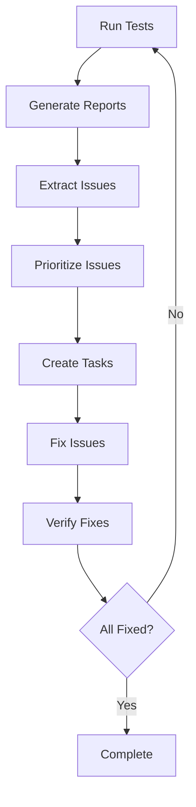

# Task Iteration Process for Bug Resolution

## Overview
This document defines a systematic process for converting test reports into actionable tasks and iterating until all issues are resolved.

## The TRIAGE Process

### 1. **T**est & Report
- Run comprehensive tests
- Generate detailed reports
- Document all failures

### 2. **R**eview & Analyze
- Identify root causes
- Group related issues
- Prioritize by severity

### 3. **I**ssue Tracking
- Create specific task items
- Assign priorities
- Set measurable success criteria

### 4. **A**ct & Fix
- Implement solutions
- Test fixes immediately
- Document changes

### 5. **G**enerate Next Cycle
- Re-run tests
- Update reports
- Create new task list

### 6. **E**valuate Progress
- Track completion rate
- Identify blockers
- Adjust approach if needed

## Implementation Framework

### Step 1: Issue Extraction Script
Create a script to automatically extract issues from reports:

```python
# /src/arangodb/tools/extract_issues.py
import json
from pathlib import Path
from datetime import datetime

def extract_issues_from_reports():
    """Extract all issues from test reports."""
    issues = []
    report_dir = Path("docs/reports/module_tests")
    
    for report_file in report_dir.glob("*.md"):
        # Parse report and extract failures
        with open(report_file, 'r') as f:
            content = f.read()
            # Extract failed tests and errors
            # Add to issues list
    
    return issues

def prioritize_issues(issues):
    """Prioritize issues by severity and dependencies."""
    # High: Import errors, missing modules
    # Medium: Failed functionality
    # Low: Performance, style issues
    pass

def create_task_list(prioritized_issues):
    """Generate actionable task list."""
    tasks = []
    for issue in prioritized_issues:
        task = {
            "id": generate_task_id(),
            "title": issue["title"],
            "description": issue["description"],
            "priority": issue["priority"],
            "success_criteria": define_success_criteria(issue),
            "estimated_time": estimate_time(issue)
        }
        tasks.append(task)
    return tasks
```

### Step 2: Task Generation Template
```markdown
# Task [ID]: [Title]

## Priority: [HIGH/MEDIUM/LOW]

## Issue Description
[Detailed description of the problem]

## Root Cause
[Analysis of why this is happening]

## Solution Approach
1. [Step 1]
2. [Step 2]
3. [Step 3]

## Success Criteria
- [ ] Test passes
- [ ] No import errors
- [ ] Function returns expected output

## Test Command
```bash
python test_specific_function.py
```

## Verification
```python
# Code to verify the fix
```
```

### Step 3: Iteration Tracking
```yaml
# iteration_tracker.yaml
iterations:
  - iteration: 1
    date: 2025-05-16
    issues_found: 15
    issues_fixed: 8
    new_issues: 2
    
  - iteration: 2  
    date: 2025-05-17
    issues_found: 9
    issues_fixed: 7
    new_issues: 0
```

## Automation Tools

### 1. Issue Extractor
Automatically parse reports and create issue list:
```bash
python tools/extract_issues.py --reports-dir docs/reports
```

### 2. Task Generator
Convert issues to actionable tasks:
```bash
python tools/generate_tasks.py --issues issues.json --output docs/tasks/
```

### 3. Progress Tracker
Monitor iteration progress:
```bash
python tools/track_progress.py --show-dashboard
```

### 4. Test Runner
Run specific test suites:
```bash
python tools/run_tests.py --module cli --verbose
```

## Process Workflow



## Best Practices

### 1. One Fix at a Time
- Fix one issue completely before moving to next
- Test immediately after each fix
- Commit working code frequently

### 2. Document Everything
- Record what was changed
- Note any side effects
- Update relevant documentation

### 3. Test Incrementally
- Run tests after each fix
- Don't wait to test multiple fixes together
- Catch regressions early

### 4. Track Dependencies
- Note which issues block others
- Fix blocking issues first
- Update dependency tree as you progress

## Example Implementation

### Current Issues to Tasks
Based on Task 012 findings, here's how to convert to tasks:

1. **HIGH PRIORITY: Fix Memory Module Imports**
   ```markdown
   # Task 013-01: Fix memory_commands.py imports
   
   ## Issue
   ModuleNotFoundError: No module named 'arangodb.core.memory'
   
   ## Solution
   1. Check if memory module exists in core/
   2. Create if missing or fix import path
   3. Test with: python -m arangodb.cli.main memory --help
   ```

2. **HIGH PRIORITY: Implement Search Operations**
   ```markdown
   # Task 013-02: Implement search CLI commands
   
   ## Issue
   Search commands failing with import errors
   
   ## Solution
   1. Fix search_commands.py imports
   2. Implement missing search functions
   3. Test with: python -m arangodb.cli.main search --query test
   ```

3. **MEDIUM PRIORITY: Fix CRUD Delete**
   ```markdown
   # Task 013-03: Fix delete-lesson operation
   
   ## Issue
   Delete operation failing in CRUD module
   
   ## Solution
   1. Debug delete_document function
   2. Check database permissions
   3. Test with: python -m arangodb.cli.main crud delete-lesson test_key
   ```

## Recommended Folder Structure

```
docs/
├── tasks/
│   ├── active/          # Current iteration tasks
│   ├── completed/       # Finished tasks
│   ├── backlog/         # Future tasks
│   └── templates/       # Task templates
├── reports/
│   ├── iterations/      # Iteration summaries
│   ├── module_tests/    # Detailed test reports
│   └── dashboards/      # Progress visualizations
└── tools/
    ├── extract_issues.py
    ├── generate_tasks.py
    ├── track_progress.py
    └── run_tests.py
```

## Success Metrics

### Per Iteration
- Number of issues resolved
- Time per issue
- New issues discovered
- Test coverage increase

### Overall Progress
- Total iterations needed
- Regression rate
- Code quality improvement
- Documentation completeness

## Next Steps

1. Create the automation tools
2. Extract issues from current reports
3. Generate first iteration task list
4. Begin fixing high-priority issues
5. Track progress systematically

This process ensures continuous improvement until all tests pass.